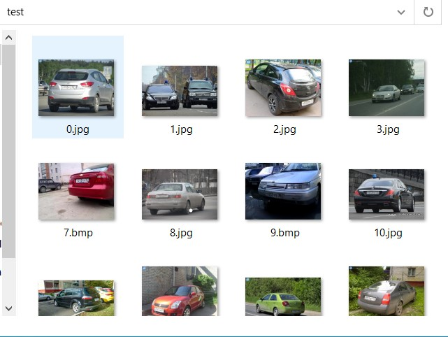
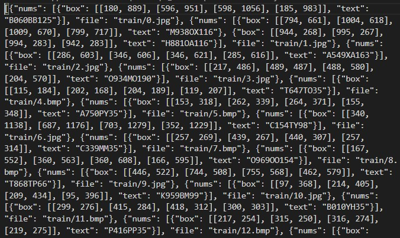
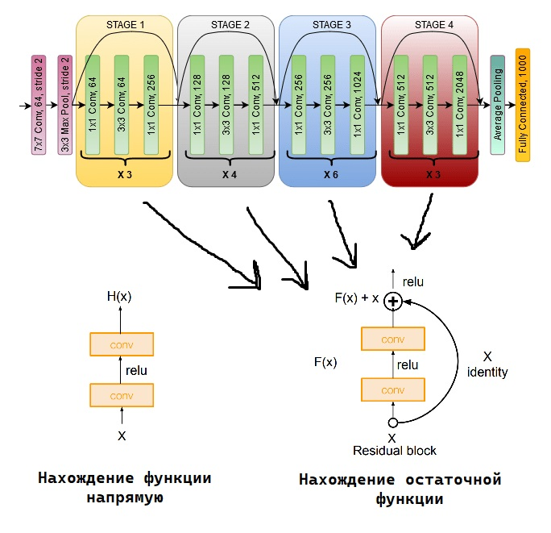
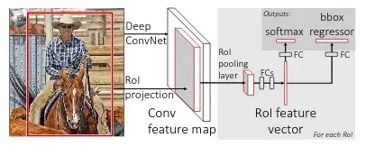
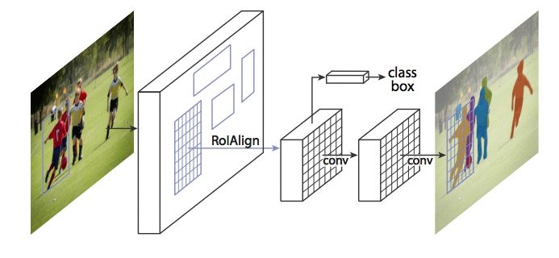
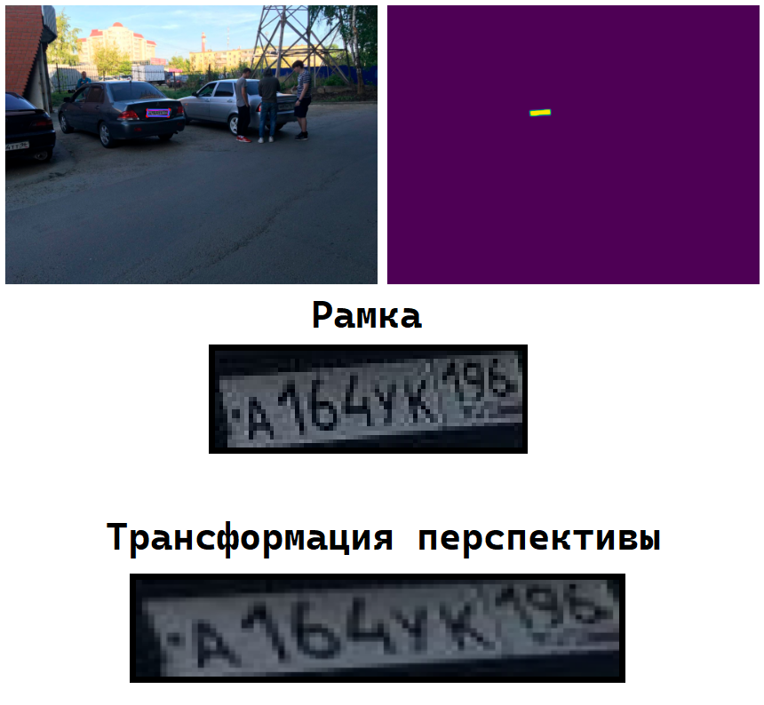

<h1 align="center">Лабораторная работа №4</h1>

<h1 align="center">Детекция российских автомобильных номеров</h2>

<h2>1. Описание датасета</h2>

Наш датасет состоит из:
- Папки `train`, в которой 25 000+ фотографий автомобилей с номерами.
- Файла `train.json`, который содержит информацию о каждой фотографии обучающего датасета.
- Папки `test`, в которой 3 000+ фотографий автомобилей с номерами.

<figure>
  <p align="center"></p>
</figure>
<p align="center"><i>Содержание папки "test"</i></p><br><br>
<figure>
  <p align="center"></p>
</figure>
<p align="center"><i>Содержание файла train.json</i></p><br><br>

<h2>2. Подготовка данных для модели</h2>

Чтобы мы могли работать с нашим датасетом, необходимо разархивировать архив и подготовить структуры данных, с которыми будет работать наша нейронка.

<h3>2.1 Распаковка данных</h3>
Наш датасет лежит на гугл диске. Разархивируем его в блокноте.

```
from google.colab import drive
drive.mount('/content/drive/')
```

```
!unzip /content/drive/MyDrive/archive.zip 
```

<h3>2.2 Преобразование данных для передачи в модель</h3>

Укажем константы, которые будем использовать в дальнейшем для работы с данными.

```
DATA_PATH = './data/' # путь к нашему датасету
TRAIN_SIZE = 0.9 # размер обучающей выборки
BATCH_SIZE = 2 # размер пакета (2 фотки)
DETECTOR_MODEL_PATH = 'detector.pt' # название для сохранения обученной модели

all_marks = load_json(os.path.join(DATA_PATH, 'train.json')) # считываем метки из json файла
test_start = int(TRAIN_SIZE * len(all_marks)) # индекс элемента для среза на обучение и валидацию
train_marks = all_marks[:test_start] # обучающая выборка 
val_marks = all_marks[test_start:] # валидационная выбока

device = torch.device('cuda') if torch.cuda.is_available() else torch.device('cpu')
```

Создадим класс для выборок, используя `Dataset` из библиотеки `PyTorch`.

```
class DetectionDataset(Dataset):
    # инициализация класса
    def __init__(self, marks, img_folder, transforms=None):
        
        self.marks = marks
        self.img_folder = img_folder
        self.transforms = transforms
    
    # загружаем/возвращаем выборку по указаному индексу
    def __getitem__(self, idx):
        item = self.marks[idx] # элемент
        img_path = f'{self.img_folder}{item["file"]}' # путь к элементу
        img = Image.open(img_path).convert('RGB') # загружаем изображение
        w, h = img.size # размер изображения
        
        box_coords = item['nums'] # инфа о элемнте
...
```

Создадим наши выборки

```
# трансормация в тензор
my_transforms = transforms.Compose([
    transforms.ToTensor()
])

# создаём класс для обучающей выборки
train_dataset = DetectionDataset(
    marks=train_marks, 
    img_folder='data/', 
    transforms=my_transforms
)

# создаём класс для валидационной выборки
val_dataset = DetectionDataset(
    marks=val_marks, 
    img_folder='data/', 
    transforms=my_transforms
)
```

Последний этап подготовки данных – это разбиение на пакеты.

```
# функция создания пакета
def collate_fn(batch):
    return tuple(zip(*batch))

train_loader = DataLoader(
    train_dataset, #наш класс датасета
    batch_size=BATCH_SIZE, # размер пакета
    drop_last=True, # отбрасываем последний неполный пакет
    num_workers=4, # многопроцессорная загрузка данных (4 рабочих процесса загрузчика)
    collate_fn=collate_fn, # функция создания пакета
)

val_loader = DataLoader(
    val_dataset, 
    batch_size=BATCH_SIZE, 
    drop_last=False,
    num_workers=4,
    collate_fn=collate_fn, 
)
```

В итоге получаем две выборки – тренировочную и валидационную.

<h2>3. Модель детекции/сегментации</h2>

У нас есть данные о 4 точках. Эти 4 точки - почти всегда не прямоугольник, а произвольный четырехугольник. Будем предсказывать:

- bounding box, который окружает точки (детекция)
- маску, заполненную тем, что внутри 4-х точек (сегментация)

Поэтому, возьмем maskrcnn. Будем обучать несколько последних слоёв. 

<h3>3.1 Создание модели</h3>

В основе нашей модели будет лежать архитектура `MaskRCNN_ResNet50_FPN`, которая в свою очередь состоит из:
1. `ResNet50`
Особенность ResNet состоит в том, что она "пропускает" некоторые слои. Они больше не содержат признаков и используются для нахождения остаточной функции H(x) = F(x) + x вместо того, чтобы искать H(x) напрямую.
<figure>
  <p align="center"></p>
</figure>
<p align="center"><i>архитектура ResNet</i></p><br><br>

2. `Fast R-CNN`
Изображение подается на вход сверточной нейронной сети и обрабатывается `selectivesearch`. В итоге, имеем карту признаков и регионы потенциальных объектов. Координаты регионов потенциальных объектов преобразуются в координаты на карте признаков. Полученная карта признаков с регионами передается слою `RoI (Region of Interest) polling layer`. Здесь на каждый регион накладывается сетка размером HxW. Затем применяется `MaxPolling` для уменьшения размерности. Так, все регионы потенциальных объектов имеют одинаковую фиксированную размерность. Полученные признаки подаются на вход полносвязного слоя (`Fully-conectedlayer`), который передается двум другим полносвязным слоям. Первый с функцией активацией `softmax` определяет вероятность принадлежности классу, второй — границы (смещение) региона потенциального объекта.
<figure>
  <p align="center"></p>
</figure>
<p align="center"><i>Архитектура Fast R-CNN</i></p><br><br>

3. `Mask R-CNN`
Mask R-CNN развивает архитектуру `Fast R-CNN` путём добавления ещё одной ветки, которая предсказывает положение маски, покрывающей найденный объект, и, таким образом решает уже задачу сегментации. Маска представляет собой просто прямоугольную матрицу, в которой 1 на некоторой позиции означает принадлежность соответствующего пикселя объекту заданного класса, 0 — что пиксель объекту не принадлежит.
<figure>
  <p align="center"></p>
</figure>
<p align="center"><i>Архитектура Mask R-CNN</i></p><br><br>


```
def get_detector_model():
    
    model = models.detection.maskrcnn_resnet50_fpn(
        weights=weights,
        weights_backbone=weights_backbone,
        num_classes=91, # вроде как это по дефолту, но на всякий укажем
    )

    #Исходная модель рассчитана на детекцию 91 класса. 
    #Нам нужно детектировать только один объект, поэтому необходимо заменить box_predictor внутри модели. 
    #Меняем количество выходов на 2, потому что нулевым классом должен быть фон.
    num_classes = 2
    in_features = model.roi_heads.box_predictor.cls_score.in_features 
    
    box_predictor = FastRCNNPredictor(in_features, num_classes) # детекция
    model.roi_heads.box_predictor = box_predictor
    
    mask_predictor = MaskRCNNPredictor(256, 256, num_classes) # сегментация
    model.roi_heads.mask_predictor = mask_predictor

    # Заморозим все слои кроме последних трёх
    
    for param in model.parameters():
        param.requires_grad = False
        
    for param in model.backbone.fpn.parameters():
        param.requires_grad = True

    for param in model.rpn.parameters():
        param.requires_grad = True

    for param in model.roi_heads.parameters():
        param.requires_grad = True
    
    return model
```

Получившаяся модель позволяет производить детекцию и сегментацию на изображении.

<h3>3.2 Обучение модели</h3>

В целом обучение выглядит стандартно, считаем лоссы делаем шаги оптимизатора. Из интерестного `scheduler`, который замедляет скорость обучения в случае если метрики меняются медленно.

```
optimizer = torch.optim.Adam(model.parameters(), lr=3e-4) # Оптимизатор
scheduler = torch.optim.lr_scheduler.ReduceLROnPlateau(optimizer, patience=20, factor=0.5, verbose=True) # Замедляет обучение, если метрика перестаёт улучшаться

model.train()
for epoch in range(1):

    print_loss = []
    for i, (images, targets) in tqdm.tqdm(enumerate(train_loader), leave=False, position=0, total=len(train_loader)):

        images = [image.to(device) for image in images]
        targets = [{k: v.to(device) for k, v in t.items()} for t in targets]

        loss_dict = model(images, targets)
        losses = sum(loss_dict.values())

        losses.backward()
        optimizer.step()
        optimizer.zero_grad()
        
        print_loss.append(losses.item())
        if (i + 1) % 20 == 0:
            mean_loss = np.mean(print_loss)
            print(f'Loss: {mean_loss:.7f}')
            scheduler.step(mean_loss)
            print_loss = [] 
```

<h2>4. Тестирование нашей модели</h2>

Для начала нужно создать несколько вспомогательных функций, чтобы мы могли интерпретировать и вузуилизировать данные предсказнные моделью.

<h3>4.1 Вспомогаетельые функции</h3>

Первая и самая основная функция это `visualize_prediction_plate`, которая вклчает в себя все остальные функции. Она считывает и интерпретирует данные, чтобы можно было вывести всю важную информацию в том числе и картинку с рамкой.

```
def visualize_prediction_plate(file, model, device='cuda', verbose=True, thresh=0.0, 
                               n_colors=None, id_to_name=None, show_prediction=True):
  
    my_transforms = transforms.Compose([
    transforms.ToTensor()
    ])
  
    img = Image.open(file) #загружаем изображение
    img_tensor = my_transforms(img) # трансформируем изображение в тензор
    model.to(device)
    model.eval()
    with torch.no_grad():
        predictions = model([img_tensor.to(device)])
    prediction = predictions[0] # предсказания модели
...
```

Следующая важная функция – `simplify_contour`. Она "упрощает" контур нашей маски и находит угловые точки. В дальнийшем это позволит нам сменить ракурс у картинки.

```
def simplify_contour(contour, n_corners=4):
    n_iter, max_iter = 0, 1000
    lb, ub = 0., 1.

    while True:
        n_iter += 1
        if n_iter > max_iter:
            print('Не удалось упроситить контур')
            return None

        k = (lb + ub)/2.
        eps = k*cv2.arcLength(contour, True)
        approx = cv2.approxPolyDP(contour, eps, True)

        if len(approx) > n_corners:
            lb = (lb + ub)/2.
        elif len(approx) < n_corners:
            ub = (lb + ub)/2.
        else:
            return approx
```

Функция `four_point_transform` делает трансформацию по 4 точкам. Другими словами у нас есть углы от маски и углы от прямоугольной рамки, мы трансформируем углы от маски "натгивая" их на углы от рамки. В некоторых случаях это позволяет улучшить видимость букв и цифр на номере машины.

```
def four_point_transform(image, pts):
    
    rect = order_points(pts)
    
    tl, tr, br, bl = pts
    
    width_1 = np.sqrt(((br[0] - bl[0]) ** 2) + ((br[1] - bl[1]) ** 2))
    width_2 = np.sqrt(((tr[0] - tl[0]) ** 2) + ((tr[1] - tl[1]) ** 2))
    max_width = max(int(width_1), int(width_2))
    
    height_1 = np.sqrt(((tr[0] - br[0]) ** 2) + ((tr[1] - br[1]) ** 2))
    height_2 = np.sqrt(((tl[0] - bl[0]) ** 2) + ((tl[1] - bl[1]) ** 2))
    max_height = max(int(height_1), int(height_2))
    
    dst = np.array([
        [0, 0],
        [max_width, 0],
        [max_width, max_height],
        [0, max_height]], dtype = "float32")
    
    M = cv2.getPerspectiveTransform(rect, dst)
    warped = cv2.warpPerspective(image, M, (max_width, max_height))
    return warped
```

Другие функции не настолько важные для рассмотрения, их можно увидить в исходном файле.

<h3>4.2 Вывод на тестовой фотографии</h3>

Попросим друга скинуть фотку c машиной и посмотрим на результат.

<figure>
  <p align="center"></p>
</figure>
<p align="center"><i>Результат работы модели</i></p><br><br>

Как мы видим, модель смогла найти номер машины.
Слева находится оригинал с рамкой, справа маска. Благодаря маске мы можем совершить трансформацию переспективы, что мы и наблюдаем. К сожалению не всегда трансформация позволяет улучшить видимость символов на номере машины.

<h2 align="center">Литература</h2>

1) Подготовка данных для модели:
    - [PyTorch Dataset](https://pytorch.org/tutorials/beginner/basics/data_tutorial.html#creating-a-custom-dataset-for-your-files).
    - [PyTorch DataLoader](https://pytorch.org/docs/stable/data.html).
2) Создание модели:
    - [PyTorch ResNet50](https://pytorch.org/vision/main/models/generated/torchvision.models.resnet50.html).
    - [PyTorch MaskRCNN_ResNet50_FPN](https://pytorch.org/vision/main/models/generated/torchvision.models.detection.maskrcnn_resnet50_fpn.html).
    - [Habr Fast-rcnn](https://habr.com/ru/post/579050/). 
    - [Habr Mask R-CNN](https://habr.com/ru/post/665300/).
